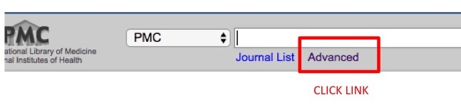
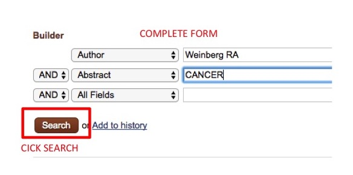
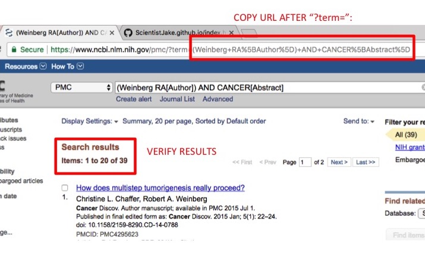

# scrape_PMC  
A set of tools to automate image and pdf downloads from pub med central.  

#### Contents: 
1. <a href= #about>About</a>  
2. <a href= #advanced>Advanced Searches</a>
3. <a href = #.py>scrape_PMC.py</a>  
  a. requirements  
  b. usage   
  c. limitations
4. <a href = #.r>scrape_PMC.r</a>  
  a. requirements  
  b. usage  
  c. limitations

## 1. About 
scrape_PMC.py and it's cousin scrape_PMC.r are a set of functions to retrieve PMC ids, download article metadata, figures, and pdfs, given a valid searchterm. The defualt usage downloads article pdfs, metadata, and figures (and captions) and saves them in subfolders.
The python implementation (python3) is a command line program accepting arguments to limit the search and control output.
Note that NCBI explicitly prohibits paralell requests when using their services so please do not abuse their servers.
You may also consider running the program after hours if your id list is long.
 This tool isn't perfect and is bound to miss things, especially older articles where the formatting of the pmc html is different.
 Suggestions for improvements to the flexibility of the scrape are welcomed.
## 2. Advanced Searches  
Simple search terms often return many results. The default output is a maximum of 20 articles, retrieved in order of relevance.
<a href = #.py>scrape_PMC.py</a> offers date limits to narrow the search. To further refine the results, advanced searches can be used to limit the searchterm by author, journal etc.
To do this, use pubmed central's search builder.  
-First go to <a href='https://www.ncbi.nlm.nih.gov/pmc/'>pubmed central</a>:  
-Then click advanced:  
</img>  
-Use the form to build the query:  
</img>  
-Click 'Search'.  
-Verify the results and copy the url after `?term=`:  
</img>  
-Use this as the search term.  

## 4. scrape_PMC.py  
### a. requirements 
  1. `python3.6.X` or greater
  2. <a href='https://www.crummy.com/software/BeautifulSoup/'>`beautifulsoup4`</a> (comes with anaconda distro)  
### b. usage  
`python scrape_PMC.py searchterm --max_retrieve --min_date --max_date --ids_only --pdfs_only --dump_mode --quiet`  
`searchterm`: a valid PMC search term. See <a href=#advanced>'constructing advanced search terms'</a> for complex searches.  
`--max_retrieve`: the maximum number of matching articles to retrieve. Default = 20. Article list is ranked by relevance to search term.  
`--min_date`: oldest publication date limit. must be used with `--max_date`.  
`--max_date`: newest publication date limit. must be used with `--min_date`.  
`--pdfs_only`: only output pdfs, not figures.  
`--dump_mode`: save pdfs to current working directory (won't create sub directories). Can only be used with `--pdfs_only`.  
`--quiet`: only output errors to std out.  
### c. limitations  
Scrapes occasionally fail for older articles and very occasionally the figure file names include part of the caption.
 There is room for improvement in the scrape code.  
 `--dump_mode` for now only works with `--pdfs_only` this is to avoid duplicate figure names being dumped into one directory.
  Could consider adding the author and year in the figure file name in the future.  
  
## 3. scrape_PMC.r  
### WARNING: I Stopped working on this one!  
### May or may not work.
### Use the python version!  
A set of functions that could eventually be packaged. 
Development on hold in favor of scrape_PMC.py
### a. requirements  
  1. `RCurl`  
  2. `XML`  
  3. `httr`  
  4. `rvest`  
  5. `stringr`
### b. usage  
Retrieve pubmed central ids using a searchterm:  
`getPMCIds(searchterm,database,maxretrieve)`  
`searchterm`: a string to search pmc. See <a href=#advanced>Advanced Searches</a> for help constructing an advanced term.  
`database`: Database to search.  default = `pmc`.  
`maxretrieve`:  number of articles to retrieve. Default = 20. Article list is ranked by relevance to search term. 

Get metadata for an article:  
`getSummary(id, database="pmc")`  
`id`: pubmed central id  
`database`: database to search. default =`pmc`.  

Download article figures and metadata.  
`downloadArticles(searchterm, database='pmc', max_results=20)`  
`searchterm`: a string to search pmc. See <a href=#advanced>Advanced Searches</a> for help constructing an advanced term. 
`database`: Database to search.  default = `pmc`.  
`max_results`:  number of articles to retrieve. Default = 20. Article list is ranked by relevance to search term.  
### c. limitations 
Still need to add PDF downloading, and `pdf_only` mode.

